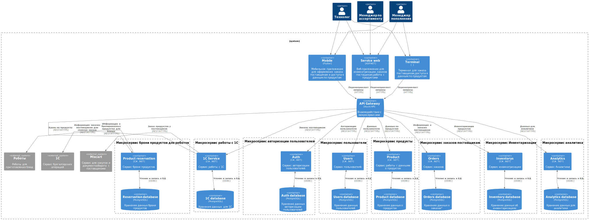

# Компонентная архитектура

## Обоснование выбора архитектурного стиля

Микросервисная архитектура является эффективным подходом для разработки приложений, которые должны масштабироваться и быть гибкими в изменении. В случае приложения для бронирования столиков в ресторанах, микросервисная архитектура может предоставить следующие преимущества:

- Гибкость: Микросервисы могут быть разработаны и развернуты независимо друг от друга, что позволяет быстро вносить изменения в приложение без необходимости перезапуска всего приложения.

- Масштабируемость: Микросервисы могут быть масштабированы отдельно друг от друга, что позволяет легко управлять нагрузкой на приложение и обеспечивать высокую доступность.

- Устойчивость: Если один из микросервисов не работает, остальные микросервисы могут продолжать работу, что обеспечивает устойчивость приложения в целом.

- Легкость разработки: Разработчики могут работать над отдельными микросервисами, что упрощает процесс разработки и тестирования.

- Легкость внедрения новых функций: Новые функции могут быть добавлены в виде новых микросервисов, что позволяет быстро внедрять новые возможности в приложение.

## Диаграмма компонентов

На диаграмме представлены компоненты микросервисной архитектуры системы и интеграции между данными компонентами.

## Описание компонентов

<table><tr><th valign="top">Приложение</th><th valign="top">Тип</th><th valign="top">Наименование</th><th valign="top">Описание</th><th valign="top">Взаимодействия             </th></tr>
<tr><td valign="top">API Gateway</td><td valign="top">Container</td><td valign="top">API Gateway</td><td valign="top">Обеспечивает интерфейс для взаимодействия с микросервисами.</td><td valign="top">Принятие запросов от мобильного приложения, терминала и веб-сервиса.</td></tr>
<tr><td valign="top">Mobile App</td><td valign="top">Container</td><td valign="top">Mobile App</td><td valign="top">Мобильное приложение для оформления заказов и доступа к данным о продуктах.</td><td valign="top">Отправляет запросы через API Gateway к микросервисам.</td></tr>
<tr><td valign="top">Terminal</td><td valign="top">Container</td><td valign="top">Terminal</td><td valign="top">Терминал для заказа поставщикам и доступа к данным о продуктах.</td><td valign="top">Взаимодействует с API Gateway для оформления заказов.</td></tr>
<tr><td valign="top">Service Web</td><td valign="top">Container</td><td valign="top">Service Web</td><td valign="top">Веб-приложение для инвентаризации и заказов у поставщиков.</td><td valign="top">Работает через API Gateway для получения и отправки информации.</td></tr>

<tr><td rowspan="2" valign="top">Микросервис авторизации пользователей</td><td valign="top">Container</td><td valign="top">Auth</td><td valign="top">Сервис авторизации пользователей.</td><td valign="top">Взаимодействует с Auth database для сохранения и извлечения данных.</td></tr>

<tr><td valign="top">Container</td><td valign="top">Auth Database</td><td valign="top">Хранит данные авторизации пользователей.</td><td valign="top">Чтение и запись данных авторизации.</td></tr>
<tr><td rowspan="2" valign="top">Микросервис пользователи</td><td valign="top">Container</td><td valign="top">Users</td><td valign="top">Сервис пользователей.</td><td valign="top">Взаимодействует с Users database для сохранения и извлечения данных.</td></tr>
<tr><td valign="top">Container</td><td valign="top">Users Database</td><td valign="top">Хранит данные пользователей.</td><td valign="top">Чтение и запись данных пользователей.</td></tr>

<tr><td rowspan="2" valign="top">Микросервис  продукты</td><td valign="top">Container</td><td valign="top">Product</td><td valign="top">Сервис работы с данными о продуктах.</td><td valign="top">Взаимодействует с Product database для хранения информации о продуктах.</td></tr>

<tr><td valign="top">Container</td><td valign="top">Product Database</td><td valign="top">Хранит информацию о продуктах.</td><td valign="top">Чтение и запись данных о продуктах.</td></tr>
<tr><td rowspan="2" valign="top">Микросервис заказов поставщикам</td><td valign="top">Микросервис</td><td valign="top">Orders</td><td valign="top">Сервис обработки заказов от поставщиков.</td><td valign="top">Взаимодействует с Orders database для хранения данных о заказах.</td></tr>
<tr><td valign="top">База данных</td><td valign="top">Orders Database</td><td valign="top">Хранит информацию о заказах.</td><td valign="top">Чтение и запись данных о заказах.</td></tr>
<tr><td rowspan="2" valign="top">Микросервис брони продуктов для роботов</td><td valign="top">Микросервис</td><td valign="top">Reservation</td><td valign="top">Сервис бронирования продуктов.</td><td valign="top">Взаимодействует с Reservation database для хранения информации о бронированиях.</td></tr>
<tr><td valign="top">База данных</td><td valign="top">Reservation Database</td><td valign="top">Хранит информацию о бронированных продуктах.</td><td valign="top">Чтение и запись данных о бронированиях.</td></tr>
<tr><td rowspan="2" valign="top">Микросервис работы с 1С</td><td valign="top">Микросервис</td><td valign="top">1С</td><td valign="top">Сервис для интеграции с 1С (бухгалтерский учет).</td><td valign="top">Взаимодействует с 1С database для хранения бухгалтерских данных.</td></tr>
<tr><td valign="top">База данных</td><td valign="top">1С Database</td><td valign="top">Хранит данные для интеграции с 1С.</td><td valign="top">Чтение и запись данных для бухгалтерских операций.</td></tr>
<tr><td rowspan="2" valign="top">Микросервис Инвентаризации</td><td valign="top">Микросервис</td><td valign="top">Inventory</td><td valign="top">Сервис инвентаризации продуктов.</td><td valign="top">Взаимодействует с базой данных инвентаризации  для хранения информации об инвентаризациях.</td></tr>
<tr><td valign="top">База данных</td><td valign="top">Inventory Database</td><td valign="top">Хранит данные об инвентаризациях.</td><td valign="top">Чтение и запись данных о инвентаризациях.</td></tr>
<tr><td valign="top">Сервис для закупок и документооборота с поставщиками</td><td valign="top">External system</td><td valign="top">Mixcart</td><td valign="top">Сервис для закупок и документооборота с поставщиками.</td><td valign="top">Взаимодействует с сервисом   1С</td></tr>
<tr><td valign="top">Сервис работы роботов</td><td valign="top">External system</td><td valign="top">Сервис Роботы</td><td valign="top">Сервис, управляющий роботами для приготовления блюд. </td><td valign="top">Взаимодействует с сервисом !!!!</td></tr>
<tr><td valign="top">Сервис бухгалтерских операций</td><td valign="top">External system</td><td valign="top">1C_Service</td><td valign="top">Система для бухгалтерских операций.</td><td valign="top">Взаимодействует с сервисом  работы с 1С</td></tr>
<tr><td valign="top">Роботы для приготовления блюд</td><td valign="top">External system</td><td valign="top">Роботы</td><td valign="top">Роботы для приготовления блюд</td><td valign="top">Взаимодействует с сервисом  брони продуктов для роботов</td></tr>
</table>

Все микросервисы и базы данных связаны с API Gateway, который служит тем самым мостом для передачи данных между различными компонентами.

- Каждый микросервис отвечает за свою область функциональности, взаимодействуя с соответствующими базами данных для хранения и обработки данных.
- Внешние системы интегрированы через соответствующие микросервисы, что позволяет эффективно управлять процессами заказа и инвентаризации.

**Таблица информационных потоков между системами**

|Container-источник|Контейнер-приемник|Передаваемая информация|Протокол взаимодействия|
| :- | :- | :- | :- |
|mobileApp|API Gateway|Перенаправление запросов|HTTPS|
|terminal|API Gateway|Перенаправление запросов|HTTPS|
|service|API Gateway|Перенаправление запросов|HTTPS|
|API Gateway|Reservation|Бронь на продукты|REST/HTTPS|
|API Gateway|1C_Service|Заказы поставщикам|REST/HTTPS|
|API Gateway|Inventory|Инвентаризация продуктов|REST/HTTPS|
|API Gateway|Auth|Авторизация пользователя|REST/HTTPS|
API Gateway|Users|Данные пользователя|REST/HTTPS|
|API Gateway|Product|Данные по продуктам|REST/HTTPS|
|API Gateway|Orders|Информация о заказах поставщикам|REST/HTTPS|
|Reservation|Роботы|Информация о бронированных продуктах для блюда|REST/HTTPS|
|1C_Service|1C|Информация о заказах поставщикам для сервера заказа|REST/HTTPS|
|1C_Service|Mixcart|Заказ продуктов у поставщиков|REST/HTTPS|
|Auth|dbAuth|Чтение и запись данных регистрации пользователей|ODBC|
|Product|dbProduct ||ODBC|
|Orders |dbOrders|Чтение и запись данных о заказах|ODBC|
|Reservation|dbReservation|Чтение и запись данных о запасах|ODBC|
|Inventory|dbInventory|Чтение и запись данных об инвентаризациях|ODBC|
|1C_Service|db1C|Чтение и запись данных для 1С|ODBC|

