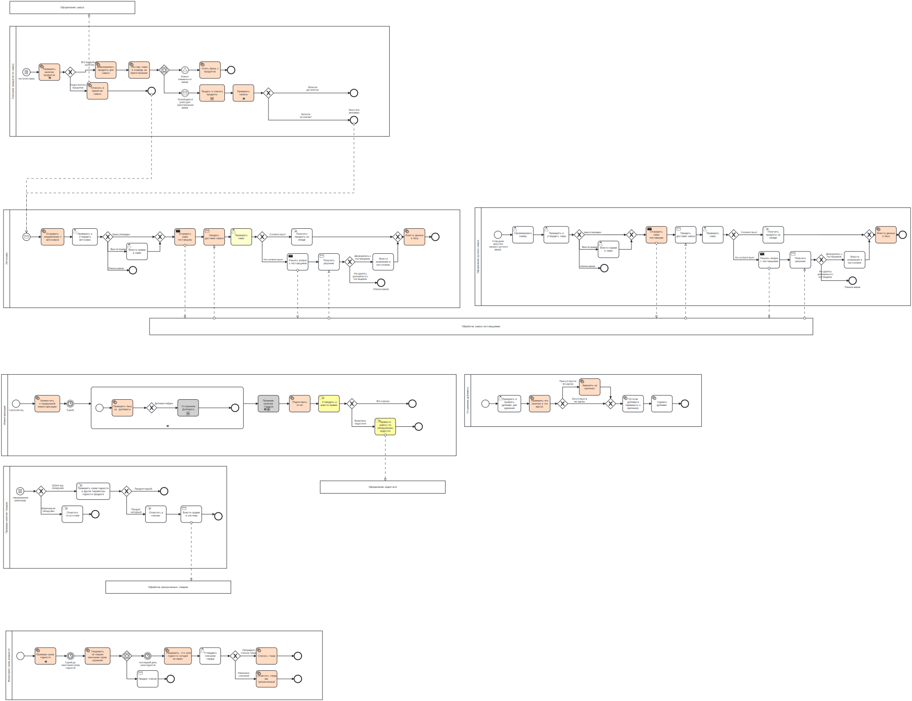

# Описание бизнес-процессов

## Инвентаризация:
На схеме представлены следующие бизнес-процессы:

- Инвентаризация
- Проверка наличия товаров
- Проверка на дубликаты
- Списание продуктов для заказа блюда 

##Заказ:
- Автозаказ
- Оформление ручного заказа

##Контроль сроков:
- Мониторинг сроков годности

