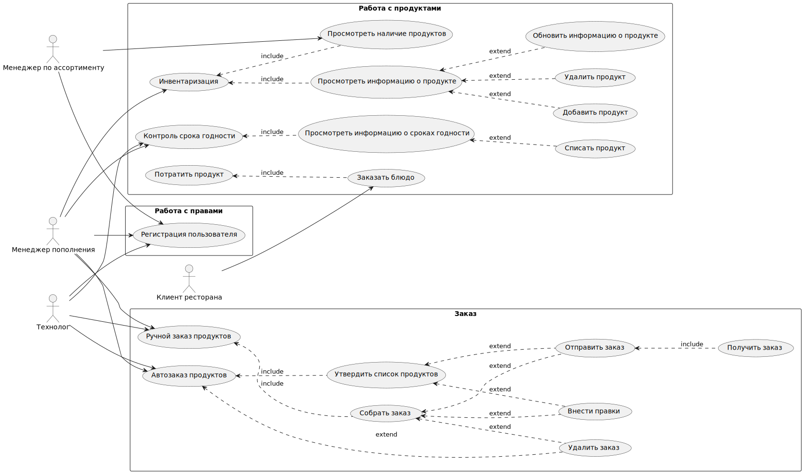

# Информационная модель

## Модель предметной области

В рамках MVP проекта были выделены основные сущности с атрибутами и определены связи между ними.
###Сущности:
- Продукт: 
 Содержит  характеристики  продукта, включая его название, количество на складе, срок годности, уровень запаса, при котором необходимо сделать заказ, и информацию о поставщике.

- Поставщик:
    Сущность, представляющая компанию или физическое лицо, поставляющее продукты. Содержит информацию о названии, адресе, номере телефона, электронной почте и контактном лице для связи.

- Пользователь:
   Сущность, представляющая информацию о пользователе данной системы, Содержит личные данные пользователя, такие как имя, фамилия, адрес электронной почты, телефон и пароль для авторизации.

- Заказ поставщику:
    Сущность, представляющая автозаказ или ручной заказ в системе, Включает дату заказа, информацию о поставщике, статус заказа, общую стоимость и список продуктов, которые были заказаны, а также склад, на который будет осуществлена доставка.

- Заказа в ресторане:
 Сущность, представляющая заказ, сделанный клиентом в ресторане. Содержит дату заказа, информацию о пользователе, статус заказа, список заказанных блюд и общую стоимость заказа.

- Инвентаризация:
   Сущность, представляющая процесс проверки и учета запасов на складе. Включает дату инвентаризации, информацию о пользователе, проводившем инвентаризацию, список проверяемых продуктов и возможные комментарии.

- Типы доступов :
   Перечисление возможных ролей пользователей и доступных действий для каждой типа доступа. Например, администратор, менеджер ассортимента, менеджер пополнения.

- Технологическая карта:
Сущность, содержащая информацию о рецепте и продуктах. Включает наименование блюда, список необходимых продуктов, инструкции по приготовлению и время, необходимое для приготовления.

- Типы продуктов: 
  Список  категорий продуктов, включая их название и описание. 

- Очередь на выдачу :
Список  продуктов, находящихся в очереди на выдачу, у которых срок годности подходит к концу.

- Склад:
   Сущность, в которой содержится информация о складах ресторана 
Включает наименование склада, адрес, максимальную емкость и текущую загрузку склада.

- Бронь продуктов для роботов: 
   Сущность, представляющая бронирование продуктов для заказов ресторана, предназначенных для приготовления блюд роботами кухни.Включает информацию о продукте, количестве и соответствующем заказе.

- Статус заказа:
  Перечисление возможных статусов заказа, таких как новый, утвержденный, оплаченный, в пути и доставленный, используется для отслеживания состояния заказа продуктов поставщику на разных этапах.

