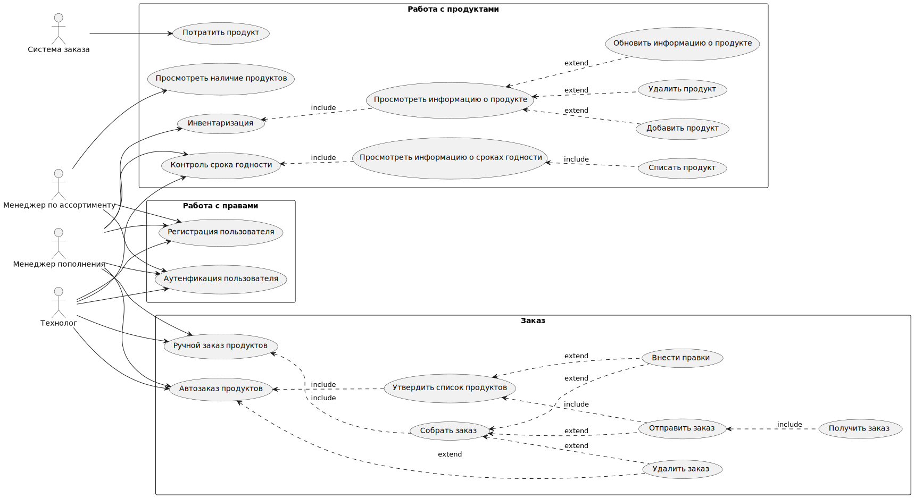

# Требования к системе

## Требования к системе в целом

### Производительность

**`NFPER1`** Система должна обслуживать не менее 30 пользователей в период пиковой активности с 08:00 до 20:00 по местному времени

**`NFPER2`** Приложение должно обеспечивать время отклика не более 1 секунд для выполнения основных операций (например, добавление, редактирование и удаление продуктов) в 80% случаев .

**`NFPER3`** Приложение должно эффективно обрабатывать инвентаризацию на уровне до 10,000 единиц товаров без значительного ухудшения производительности. 

### Безопасность

**`NFSEC1`** 
 Система должна предусматривать аутентификацию пользователей в системе по логину  и паролю.

**`NFSEC2`** Пользователи должны обязательно аутентифицироваться для просмотра и выполнения действий

**`NFSEC3`** Приложение должно поддерживать  управление доступом на основе ролей.(администратор/пользователь)

### Масштабируемость

**`NFEXT1`**  Система должна поддерживать возможность добавления новых серверов для обработки увеличивающегося количества запросов и данных.
**`NFEXT2`** Приложение должно позволять управлять  системой хранение продуктов, инвентаризацией и автозаказом без потери текущей производительности при приросте  2 ресторана в год.

### Надежность

**`NFROB1`** Вероятность возникновения критической ошибки должна составлять не более 0,5 % обращений.

**`NFROB2`** Система должна демонстрировать уровень надёжности, при котором время восстановления после сбоя в работе отдельной функции не превышает 30 с секунд в 90% случаев.  

**`NFROB3`** Приложение должно иметь механизмы для автоматического восстановления данных после сбоев, включая резервное копирование и восстановление данных.

### Совместимость

**`NFCOM1`**  Мобильное приложение должно быть совместимо с ОС Android 5.0 или выше и iOS 10 или выше.

**`NFCOM2`** Веб-приложение должно быть совместимо с браузерами, работающими на движках: Blink; Gecko; WebKit

**`NFCOM3`** Приложение должно поддерживать интеграцию с 1С, сервисом заказа ресторана, системами поставщиков.   

### Доступность

**`NFAVL1`** Допустимое время простоя в сутки не более 30 минут.
**`NFAVL2`** Уровень доступности: Система должна обеспечивать уровень доступности 98%, за исключением времени планового обслуживания.
**`NFAVL3`** Допустимое время простоя в месяц, часов, не более 5 часов  

### Особенности хранения данных

**`NFDT1`** Логи о действиях сотрудника должна храниться 2 года

**`NFDT2`** Бекапы БД должны производиться каждые 60 мин.

**`NFDT3`** Бекапы БД должны храниться 7 дней с момента создания. 

### Концептуальная целостность

**`NFARC1`** Система должна соответствовать архитектурному стилю REST. 

### Поддерживаемость

**`NFSUP1`** Необходимо логировать действия пользователей в системе. Просмотр данных логов должен осуществляться через графический интерфейс.

**`NFSUP2`**  Необходимо предоставить полную документацию как для пользователей, так и для разработчиков, включая руководства, API-документацию 

## Удобство использования

**`NFRS1`**  Приложение должно иметь адаптивный дизайн для различных устройств: мобильные телефон, планшет.

## Требования к функциям (задачам), выполняемым системой

### UseCase диаграмма

Основные функции системы представлены в виде UseCase диаграммы.  

##  Описание UseCase, реализуемых в рамках MVP

|**Название**|**Инвентаризация**|
| :- | :- |
|Краткое описание|Проведение инвентаризации продуктов ресторана|
|Субъекты|Менеджер пополнения(пользователь )|
|Предусловие|Менеджер пополнения авторизован в системе и у него есть аппарат для сканирования штрихкода |
|Постусловие|Все Продукты проверены, информация в системе верная|
|Основной сценарий|
1. Пользователь сканирует штрихкод продукта.

2. Система показывает информацию по продукту

3. Пользователь сверяет информацию

4. Если информация верная, пользователь переходит к проверке следующего продукта 

Конец сценария,когда все продукты проверены
|
|Альтернативный сценарий|
**Продукт не найден**

2А. Система выдает ошибку, что продукт не найден 

1. Пользователь добавляет информация о продукте в систему

&emsp;

**Некорректная информация в системе**

4А. Если информация некорректная:

1. Пользователь вносит правки

2. Пользователь сохраняет новую информацию

   

|
|
**Прерывание процесса:**

|

Система на любом шаге позволяет завершить процесс
|

|**Название**|**Добавить продукт**|
| :- | :- |
|Краткое описание|Добавление продукта в базу|
|Субъекты|Менеджер пополнения, технолог|
|Предусловие|Пользователь авторизован в системе находится в главном интерфейсе|
|Постусловие|Продукт добавлен в базу|
|Основной сценарий|
1. Пользователь нажимает кнопку добавить продукт

2. Система показывает форму для ввода информации

3. Пользователь заполняет необходимую информацию.

4. Пользователь нажимает кнопку для сохранения информации

5. Система сохраняет информацию в базе

6. Система показывает уведомление,что продукт успешно добавлен

Конец сценария
|
|Альтернативный сценарий|
**Пользователь передумал добавлять новый продукт**

` `3А. Пользователь закрывает форму для ввода информации

1. Система возвращается в главный интерфейс

Конец сценария

4А. Пользователь нажимает кнопку отмена

1. Система показывает форму для отмены добавления товара 

2. Пользователь отменяет добавление

3. Система возвращается в главный интерфейс
|
|
**Прерывание процесса:**

|
Система на любом шаге позволяет завершить процесс

|

|**Название**|**Обновить информацию о продукте**|
| :- | :- |
|Краткое описание|Обновление информации о продукте уже занесенном в систему|
|Субъекты|Менеджер пополнения, технолог|
|Предусловие|Пользователь авторизован в системе находится в главном интерфейсе|
|Постусловие|Информация о продукте обновлена|
|Основной сценарий|
1. Пользователь открывает информацию о необходимом продукте

2. Пользователь вносит изменения в информацию о продукте

3. Пользователь нажимает кнопку для сохранения информации

4. Система сохраняет  новую информацию  о продукте

5. Система показывает уведомление,что продукт успешно обновлен

Конец сценария
|
|Альтернативный сценарий|
**Пользователь не нажимает кнопку для сохранения информации**

3А Пользователь переходит на другую страницу или обновляет текущую

1. Система выводит предупреждение о том, что введенная информация не сохранится. Предлагает сохранить измененную информацию

2. Пользователь нажимает кнопку сохранения.

3. ` `Переход к пункту 4 основного сценария

&emsp;Конец сценария
|
|
**Прерывание процесса:**

|
Система на любом шаге позволяет завершить процесс без сохранения изменений

|

|**Название**|**Автозаказ продуктов**|
| :- | :- |
|Краткое описание|Автоматический заказ продукции при критическом количестве продукта в системе|
|Субъекты|
Менеджер пополнения(пользователь)

Система

Поставщик
|
|Предусловие|Осталось минимально допустимое количество продукта,пользователь авторизован|
|Основной сценарий|
1. Система присылает пользователю уведомлении о формировании заказа поставищку

2. Пользователь проверяет и утверждает заказ

3. Система отправляет поставщику заказ

4. Поставщик утверждает заказ

5. Система ожидает получения заказа

6. Пользователь получает заказ

7. Пользователь отмечает в системе,что заказ получен

8. Пользователь добавляет сведения в систему

Конец сценария
|
|Альтернативный сценарий|
**Пользователю требуется внести изменения в заказ**

2А Пользователь  не утверждает заказ

1. Пользователь вносит изменения в заказ

2. Возвращение к п. 2 основного сценария

Конец сценария

|
|
**Прерывание процесса:**

|Система на любом шаге позволяет завершить процесс без сохранения изменений|

|**Название**|**Ручной заказ продуктов**|
| :- | :- |
|Краткое описание|Менеджеру пополнения необходимо заказать продукты вручную|
|Субъекты|
Менеджер пополнения(пользователь)

Система

Поставщик
|
|Предусловие|Пользователь авторизован в системе|
|Основной сценарий|
1. Пользователь формирует заказ поставщику 

2. Пользователь проверяет и утверждает заказ

3. Система отправляет поставщику заказ

4. Поставщик утверждает заказ

5. Система ожидает получения заказа

6. Пользователь получает заказ

7. Пользователь отмечает в системе,что заказ получен

8. Пользователь добавляет сведения в систему

9. Конец сценария
|
|Альтернативный сценарий||
|
**Прерывание процесса:**

|Система на любом шаге позволяет завершить процесс без сохранения изменений|

|**Название**|**Контроль срока годности**|
| :- | :- |
|Краткое описание|Контроль сроков годности продуктов для предотвращения их списания|
|Субъекты|
Система

Менеджер пополнение(пользователь)
|
|Предусловие|Осталось 5 дней до окончания срока годности продукта |
|Основной сценарий|
1. Пользователю приходит уведомление о скором окончании срока годности продукта

2. Система ставит продукт первым в очередь на выдачу

3. Пользователь контролирует срок годность продукта 

4. При поступлении заказа и срок продукта еще не вышел, он выдается для приготовление заказа

Конец сценария
|
|Альтернативный сценарий|
Срок годности продукта вышел

4А Срок годности  продукта вышел

1. Пользователю приходит уведомление, что у продукта закончился срок годности

2. Пользователь списывает продукт

3. Система добавляет данные в отчет

|
|
**Прерывание процесса:**

||

|**Название**|**Списание продукта**|
| :- | :- |
|Краткое описание|Списание продуктов  в процессе инвентаризации|
|Субъекты|
Менеджер пополнение(пользователь)

Система
|
|Предусловие|Пользователь авторизован в системе. Пользователь просматривает информацию о продукте, в частности срок годности.У продукта истек срок годности или он испорчен |
|Основной сценарий|
1. Пользователь выбирает списать продукт

2. Пользователь указывает причину списания 

3. Система снимает продукт с баланса.

4. Система добавляет данные  в отчет
|
|Альтернативный сценарий||
|
**Прерывание процесса:**

|Система на любом шаге позволяет завершить процесс без сохранения изменений|

|**Название**|**Просмотреть информацию о продукте**|
| :- | :- |
|Краткое описание|Просмотреть полную  информацию о продукте|
|Субъекты|
Менеджер пополнения(пользователь)

Система
|
|Предусловие|Пользователь прошел аутентификацию в приложении|
|Основной сценарий|
1. Пользователь вводит в поле фильтра информацию  для поиска продукта

2. Система выдает результаты поиска

3. Пользователь выбирает нужный продукт

4. Система показывает окно с полной информацией о продукте

5. Пользователь закрывает окно,ознакомившись с информацией

Конец сценария

|
|Альтернативный сценарий|
**Пользователь в чтение 5  минут не закрывает окно**

5А Система возвращается в исходное окно
|
|
**Прерывание процесса:**

|Система на любом шаге позволяет завершить процесс без сохранения изменений|

|**Название**|**Аутентификация пользователя**|
| :- | :- |
|Краткое описание|Вход  зарегистрированного пользователя в систему|
|Субъекты|
1\. Клиент

2\. Система
|
|Предусловие|
Клиент уже зарегистрирован в системе администратором . Клиент открыл страницу аутентификации.

|
|Постусловие|Клиент авторизован в системе |
|Основной сценарий|
1. Клиент вводит логин и пароль.

2. Клиент пытается авторизоваться

3. Система проверяет, что логин и пароль введены корректно

4. ` `Если логин и пароль верные, аутентификация пройдена.

Конец сценария
|
|Альтернативный сценарий|
**Логин или пароль некорректны**

3А.Не найден пользователь с такими данными.

1. Система выдает сообщения,что вход не возможен и предлагает восстановить пароль. 

2. Пользователь выбирает восстановить пароль:  

1\. Система выводит диалоговое окно для ввода электронной почты указанного при регистрации.

2\. Клиент вводит данные

3\. Система отправляет новый пароль на введенный имейл.

4\. Переход к п.1 основного сценария. Конец сценария
|
|
**Прерывание процесса:**

|Система на любом шаге позволяет завершить процесс без сохранения изменений|

|**Название**|**Выдача продукта**|
| :- | :- |
|Краткое описание|Выдача продукта для приготовления заказа роботу|
|Субъекты|
1. Приложение заказа

2. Система

3. Система роботов

4. Технолог
|
|Предусловие|Клиент сделал заказ в ресторане, заказ оплачен,продукты есть в наличии роботы освободились для приготовления.|
|Основной сценарий|
1. Система роботов отправляет запрос в приложении заказа,что робот освободился

2. Приложение заказа в систему отправляет запрос для выдачи продуктов

3. Система  ищет забронированные продукты для данного заказа

4. Система снимает с баланса выбранные продукты

5. Система добавляет данные в отчет

6. Робот начинает готовить заказ

Конец сценария
|
|Альтернативный сценарий|
Произошла ошибка,нет забронированных продуктов

3А Система не нашла забронированного продукта

1. Система выдает ошибку

2. Система отправляет уведомление технологу о произошедшей ошибке

3. Технолог ищет подходящие продукты и добавляет их для приготовления заказа в систему

4. Система переходит к п. 4 основного сценария.
|
|
**Прерывание процесса:**

||

## Описание UseCase, реализуемых в рамках первого релиза

|**Название**|**Удалить продукт**|
| :- | :- |
|Краткое описание|Удаление продукта из системы|
|Субъекты|Менеджер пополнения, технолог|
|Предусловие|Пользователь авторизован и просматривает информацию о продукте|
|Постусловие|Продукт удален из базы|
|Основной сценарий|
1. Пользователь нажимает кнопку удалить продукт

2. Система показывает форму подтверждения удаления

3. Пользователь подтверждает удаление продукта

4. Система удаляет продукт, заносит в отчет

Конец сценария
|
|Альтернативный сценарий|
Пользователь передумал удалять продукт 

3А. Пользователь отменяет удаление продукта

Конец сценария
|
|
**Прерывание процесса:**

|
Система на любом шаге позволяет завершить процесс

|

|**Название**|**Регистрация пользователя**|
| :- | :- |
|Краткое описание|Регистрация пользователя для возможно управления и чтения информации о продуктах|
|Субъекты|
1\. Пользователь

2\. Система
|
|Предусловие|Пользователь зашел на страницу регистрации|
|Постусловие|Пользователь зарегистрирован в системе|
|Основной сценарий|
1. Пользователь заполняет на странице данные для регистрации

2. Система проверяет наличие в системе пользователей с такими же логином,почтой или телефоном.

3. Если  пользователь с таким и данными не существует Система отправляет код подтверждения на электронную почту

4. Система выводит диалоговое окно подтверждения номера телефона.

5. Пользователь вводит код подтверждения в диалоговом окне

6. Система сохраняет данные регистрации.

` `Конец сценария.
|
|Альтернативный сценарий|
3А: Пользователь с введенным данными  уже существует.

1\. Система выводит сообщение, что пользователь с такими данными уже зарегистрирован.

2\. Пользователь закрывает окно предупреждения

3\. Пользователь вводит новые данные для регистрации

4\. Переход к п.2 основного сценария. Конец сценария.
|
|
**Прерывание процесса:**

|Система на любом шаге позволяет завершить процесс без сохранения изменений|

