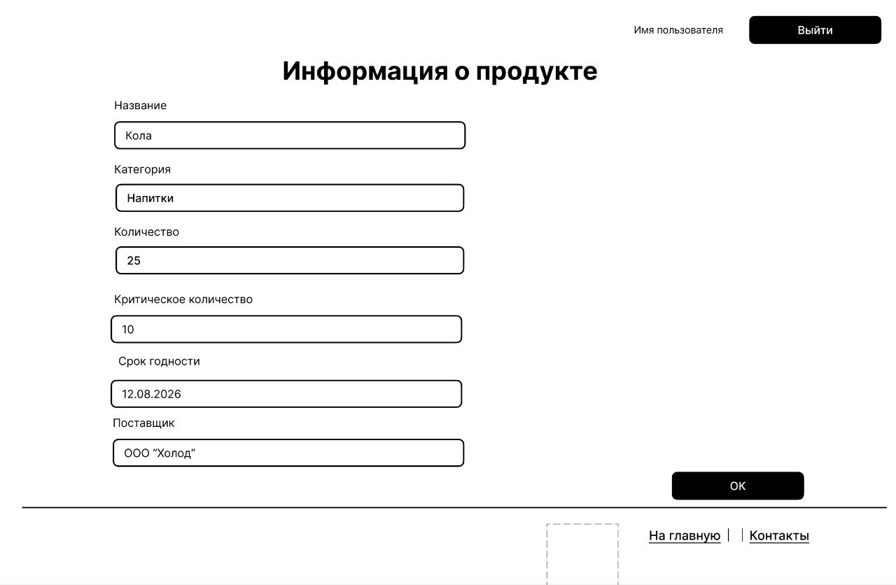
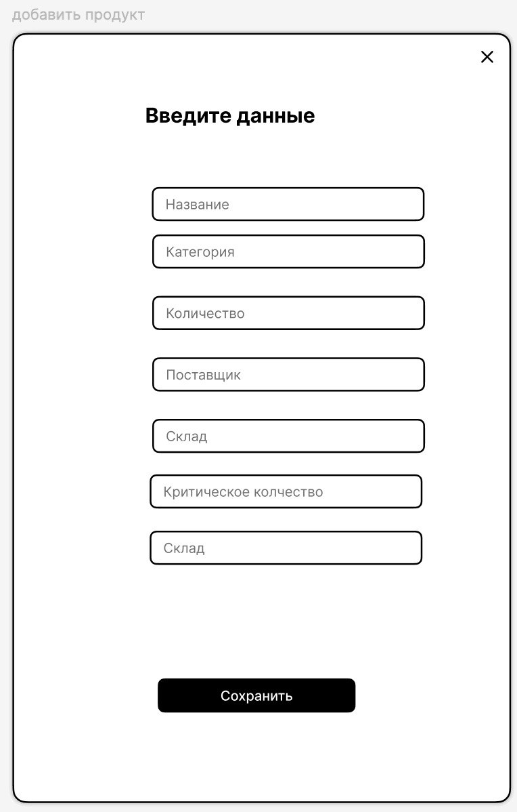
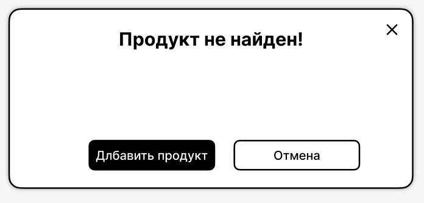
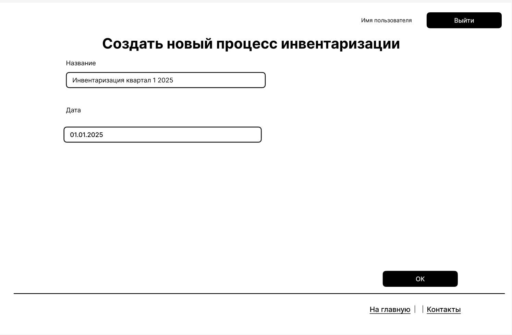
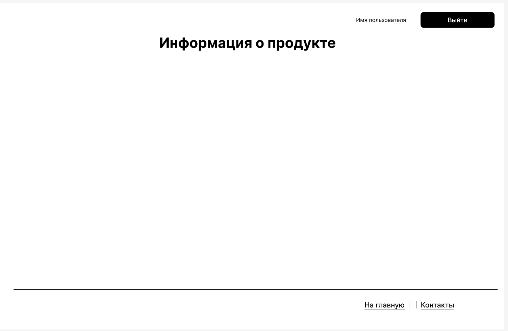
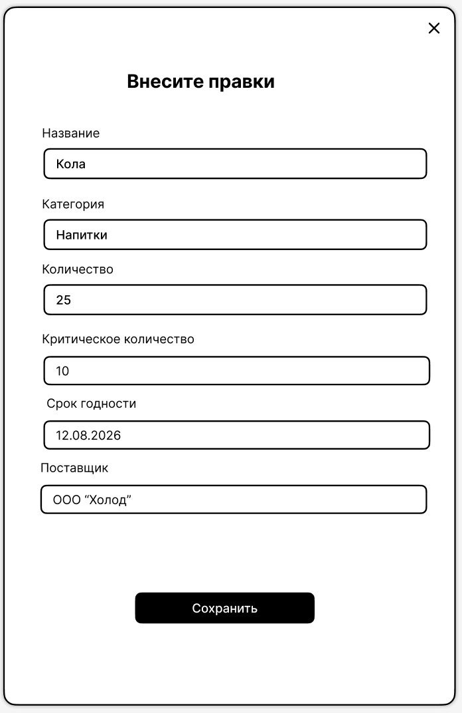

# Пользовательский интерфейс приложения

## **`WF1`** Страница продукта в инвентаризации

## **`WF2`** Форма добавления продукта

## **`WF3`** Форма ошибки(продукт не найден)

##  **`WF4`** Cоздание нового процесса инвенатризации

##  **`WF5`** Ожидание сканирование штрих-кода

##  **`WF6`** Редактирование продукта

